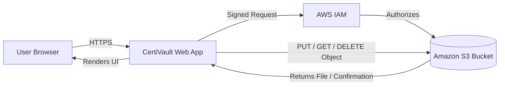

# CertiVault 🔐 — Secure Cloud Certificate Locker


A modern, cloud-based web app for securely uploading, organizing, and managing personal certificates — built as an **IBM Cloud Computing Internship** project demonstrating **Amazon S3** and **AWS IAM**.

---

## 📖 Project Overview

Students and professionals collect dozens of certificates — internships, courses, degrees, awards — and usually end up with them scattered across emails and phone galleries. **CertiVault** gives every certificate a single, organized, secure home in the cloud, with a dashboard, upload flow, searchable gallery, and profile view.

## ✨ Features

- 📤 Upload certificates with name, category, and description
- 👀 View and preview certificates in a card-based gallery
- 🔍 Search certificates by name
- 🗂️ Filter certificates by category (Internship / Academic / Achievement)
- ⬇️ Download certificates
- 🗑️ Delete certificates with confirmation
- 📊 Dashboard with live statistics and storage usage
- 🔐 Cloud storage architecture based on Amazon S3
- 🛡️ Access control explained through AWS IAM least-privilege policies
- 📱 Fully responsive, glassmorphism-styled UI

## 🖼️ Screenshots

_Add screenshots here after running the app locally:_

| Home | Dashboard | Gallery |
|------|-----------|---------|
| `screenshots/home.png` | `screenshots/dashboard.png` | `screenshots/gallery.png` |

## 🛠️ Technology Stack

**Frontend:** HTML5, CSS3, JavaScript (vanilla)
**Cloud:** Amazon S3, AWS IAM
**Optional/UI:** Font Awesome, Google Fonts (Poppins)

## ☁️ AWS Services Used (Conceptually)

| Service | Purpose |
|---|---|
| **Amazon S3** | Stores certificate files as objects in a private bucket, organized by category prefixes |
| **AWS IAM** | Provides a dedicated app identity and least-privilege policy for S3 access |

> This is a beginner/student project. The UI, dashboard, and certificate management flows are fully functional. Upload/search/delete use browser-based demo storage so the app runs without a live backend; the S3/IAM architecture below shows exactly how it would connect to real AWS infrastructure. See `about.html` for the full breakdown of what's live vs. simulated.

## 📁 Folder Structure

```
certivault/
├── index.html          # Landing page (hero, features, why AWS, testimonials)
├── login.html           # Login page (simulated auth)
├── dashboard.html        # Stats + quick actions + recent uploads
├── upload.html           # Upload form with drag-and-drop
├── gallery.html          # Searchable, filterable certificate gallery
├── profile.html          # User profile + storage usage
├── about.html            # Full project write-up + AWS architecture
├── css/
│   └── style.css        # All styling (glassmorphism, gradients, responsive)
├── js/
│   └── script.js         # All interactivity + demo data layer
├── images/               # Image assets
├── assets/               # Additional assets (icons, illustrations)
└── README.md
```

## 🏗️ Architecture



**Flow:** The user interacts with the CertiVault web app in their browser. For any file action (upload/download/delete), the app would request a signed, time-limited request authorized through an IAM policy, which then talks directly to the private S3 bucket. The bucket never allows public access — only the app's dedicated IAM identity, under a least-privilege policy, can read or write objects.

## ⚙️ Installation

No build tools or dependencies required — this is a static site.

```bash
git clone https://github.com/<your-username>/certivault.git
cd certivault
```

## ▶️ How to Run

**Option 1 — Open directly:**
Double-click `index.html` to open it in your browser.

**Option 2 — Local server (recommended for consistent behavior):**
```bash
# Python 3
python -m http.server 8000
# then open http://localhost:8000
```

**Option 3 — VS Code Live Server extension:**
Right-click `index.html` → "Open with Live Server."

## 🚀 Future Improvements

- Replace simulated login with real AWS Cognito authentication
- Connect upload/download to a live S3 bucket via pre-signed URLs
- Add AWS Lambda for automatic certificate thumbnail generation
- Serve certificate previews through Amazon CloudFront (CDN)
- Send upload confirmation emails via Amazon SES
- Add multi-file upload and drag-to-reorder categories

## 📄 License

This project is licensed under the MIT License.

## 👤 Author

**Prateek Dixit** — B.Tech ECE Student
Built as part of the IBM Generative AI / Cloud Computing Internship program.
